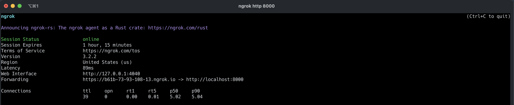
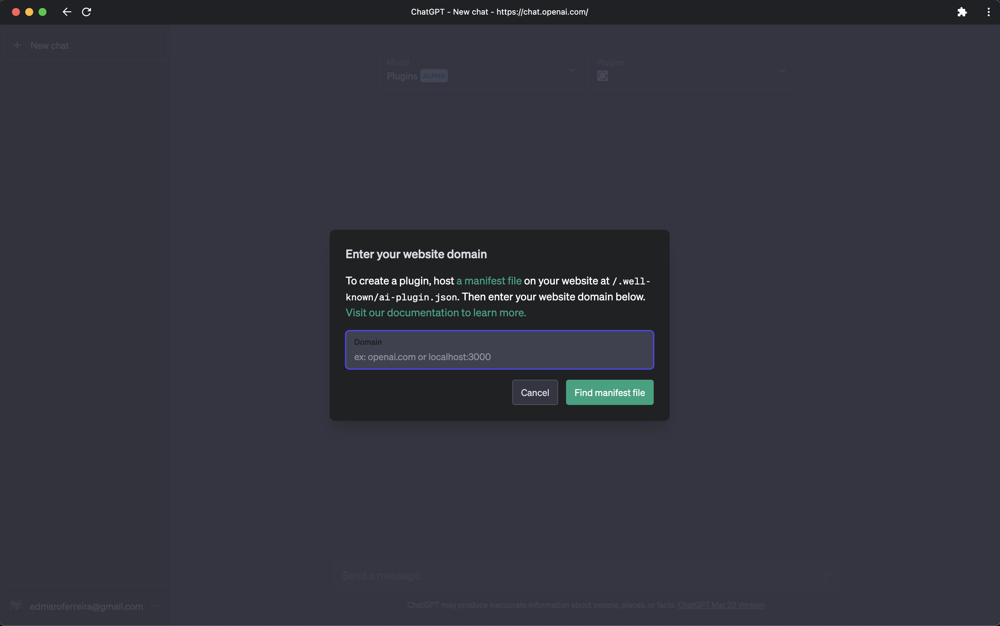
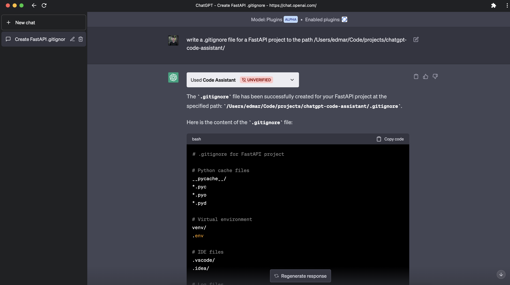

# ChatGPT Code Assistant Plugin

As an avid coder, I embarked on a personal experiment to enhance my coding experience and boost my productivity. I found ChatGPT to be a valuable tool, but copying and pasting generated code into my editor often proved inconvenient and disrupted my creative flow.

I also faced challenges due to ChatGPT's inability to access my local file system and external documentation, as it couldn't utilize my current project's code as context. This meant I had to manually copy my code to the website for further generation.

To overcome these limitations, I decided to create the ChatGPT Code Assistant Plugin. By granting ChatGPT access to both my local file system and the internet, it can now effortlessly:

- Reference online documentation to provide accurate API calls and avoid guesswork.
- Incorporate the code from my current project as context, generating more relevant and coherent suggestions.
- Read and utilize files within my project to improve overall code integration.
- Directly write to files in my project, streamlining the coding process and eliminating the need for manual copy-pasting.

## Recent Changes

- Refactored `main.py` and organized code into separate modules.
- Moved FastAPI routes to `modules/routes.py`.
- Moved Pydantic models to `modules/models.py`.
- Moved utility function to `modules/utils.py`.
- Simplified `main.py` to only initialize and run FastAPI server.

## Collaborators

- Luciano Tonet <tonetlds@gmail.com>

## Installation

```bash
pip install -r requirements.txt
```
## Usage

Run the following command to start the server:

```bash
uvicorn main:app --reload
```
Now, use ngrok to expose the server to the internet.
Ngrok is needed because the chatgpt plugins requires an https url to work.

```bash
ngrok http 8000
```


Use the ngrok url to set the server url in the plugin settings.



Here is a demo of the plugin in action:

